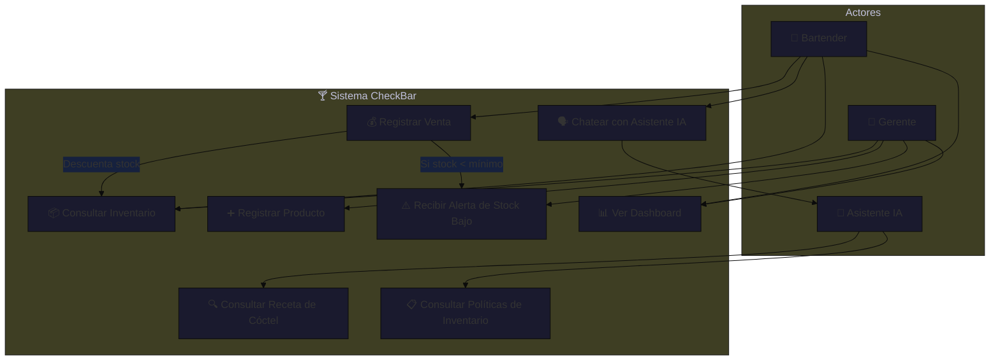

# SDD — System Design Document
## CheckBar: Sistema de Control de Inventario y Facturación para Bar con Asistente IA

**Versión:** 1.0.0  
**Fecha:** 2026-05-29  
**Autor:** Equipo de Desarrollo CheckBar  
**Estado:** Activo  

---

## 1. Resumen Ejecutivo

**CheckBar** es un sistema monolítico de gestión integral para bares y establecimientos de bebidas. Su objetivo es digitalizar y automatizar los procesos críticos del negocio: control de inventario en tiempo real, registro de ventas y facturación, y asistencia inteligente mediante IA generativa.

### 1.1 Problema que Resuelve
Los bares operan con decenas de productos (licores, mezcladores, insumos) cuya gestión manual es propensa a errores: pérdidas por vencimiento, desabastecimiento inesperado, errores en cuentas y falta de visibilidad del stock. CheckBar centraliza esta operación en una interfaz web moderna.

### 1.2 Funcionalidades Clave
| Funcionalidad | Descripción |
|---|---|
| **Inventario en Tiempo Real** | Consulta y actualización del stock de productos del bar |
| **Registro de Ventas** | Facturación de consumos con descuento automático del inventario |
| **Alertas de Stock** | Notificación cuando un producto cae por debajo del umbral mínimo |
| **Asistente IA (RAG)** | Chatbot que responde preguntas sobre recetas de cócteles y políticas de inventario |
| **Dashboard Web** | Interfaz visual moderna para gestión centralizada |

### 1.3 Alcance Técnico
- **Backend:** Python + FastAPI (API REST)
- **Base de Datos:** SQLite via SQLAlchemy ORM
- **IA:** Google Gemini API con patrón RAG
- **Frontend:** HTML5 + CSS3 + JavaScript vanilla
- **Arquitectura:** Monolito con Arquitectura Hexagonal

---

## 2. Arquitectura Hexagonal Aplicada

La Arquitectura Hexagonal (también llamada **Ports & Adapters** de Alistair Cockburn) es el patrón central de este sistema. Permite que el núcleo de negocio sea completamente independiente de los detalles de infraestructura (base de datos, API externa, interfaz de usuario).

### 2.1 Las Tres Capas

```
┌─────────────────────────────────────────────────────────────────┐
│                        ADAPTADORES                               │
│  ┌─────────────┐  ┌────────────────┐  ┌────────────────────┐   │
│  │  FastAPI     │  │  SQLite DB     │  │  Gemini AI API     │   │
│  │  (HTTP in)   │  │  (persistence) │  │  (AI adapter)      │   │
│  └──────┬──────┘  └───────┬────────┘  └─────────┬──────────┘   │
│         │                  │                      │              │
│  ┌──────▼──────────────────▼──────────────────────▼──────────┐  │
│  │                       PUERTOS                              │  │
│  │   IProductoRepository  |  IVentaRepository  | IAIAssistant│  │
│  └──────────────────────────┬───────────────────────────────┘  │
│                              │                                   │
│  ┌───────────────────────────▼─────────────────────────────┐   │
│  │                      DOMINIO                              │   │
│  │     Producto | Venta | InventarioService | Reglas        │   │
│  └───────────────────────────────────────────────────────────┘  │
└─────────────────────────────────────────────────────────────────┘
```

### 2.2 Descripción de Capas

#### 🔵 Capa de Dominio (`/src/domain/`)
El corazón del sistema. Contiene:
- **Entidades:** `Producto`, `Venta`, `LineaVenta` — objetos con identidad y comportamiento propio.
- **Servicios de Dominio:** `InventarioService` — lógica de negocio pura (sin I/O).
- **Reglas de Negocio:** Validaciones, cálculos de precio, control de stock mínimo.
- **SIN DEPENDENCIAS** de bases de datos, HTTP, o librerías externas.

#### 🟡 Capa de Puertos (`/src/ports/`)
Define las interfaces (contratos abstractos) que el dominio necesita del mundo exterior:
- `IProductoRepository` — contrato para persistir/leer productos.
- `IVentaRepository` — contrato para registrar ventas.
- `IAIAssistant` — contrato para el asistente de IA.

#### 🟢 Capa de Adaptadores (`/src/adapters/`)
Implementaciones concretas de los puertos:
- `database.py` — Implementa los repositorios con SQLite + SQLAlchemy.
- `ai_assistant.py` — Implementa el asistente con Google Gemini API.
- `static/` — Frontend web (HTML, CSS, JS).
- `main.py` — Adaptador HTTP (FastAPI).

### 2.3 Flujo de Datos (Ejemplo: Registrar Venta)

```
Usuario → POST /ventas (FastAPI)
  → FastAPI llama a InventarioService.registrar_venta()
    → InventarioService usa IProductoRepository.obtener(id)
      → SQLiteProductoRepository consulta la BD SQLite
    → InventarioService valida stock disponible
    → InventarioService calcula total
    → InventarioService usa IVentaRepository.guardar(venta)
      → SQLiteVentaRepository persiste en BD
  → FastAPI retorna respuesta HTTP 201
```

---

## 3. Diagrama de Casos de Uso



---

## 4. Diagrama Entidad-Relación (ER)

```mermaid
erDiagram
    PRODUCTOS {
        int id PK "Identificador único"
        string nombre "Nombre del producto"
        string categoria "Licor, Mezclador, Garnish, etc."
        float precio_unitario "Precio de venta"
        float precio_costo "Precio de compra"
        int stock_actual "Unidades disponibles"
        int stock_minimo "Umbral de alerta"
        string unidad_medida "Botella, Litro, Pieza"
        string proveedor "Nombre del proveedor"
        datetime created_at "Fecha de creación"
        datetime updated_at "Última actualización"
    }

    VENTAS {
        int id PK "Identificador único"
        string numero_factura "Número de factura"
        datetime fecha_venta "Timestamp de la venta"
        float total "Monto total de la venta"
        string metodo_pago "Efectivo, Tarjeta, etc."
        string estado "Completada, Cancelada"
        string notas "Observaciones opcionales"
    }

    LINEAS_VENTA {
        int id PK "Identificador único"
        int venta_id FK "Referencia a VENTAS"
        int producto_id FK "Referencia a PRODUCTOS"
        int cantidad "Unidades vendidas"
        float precio_unitario "Precio al momento de venta"
        float subtotal "cantidad x precio_unitario"
    }

    MOVIMIENTOS_INVENTARIO {
        int id PK "Identificador único"
        int producto_id FK "Referencia a PRODUCTOS"
        string tipo "entrada, salida, ajuste"
        int cantidad "Unidades movidas"
        string motivo "Venta, Compra, Merma, etc."
        datetime fecha "Timestamp del movimiento"
        int venta_id FK "Referencia a VENTAS (opcional)"
    }

    VENTAS ||--o{ LINEAS_VENTA : "contiene"
    PRODUCTOS ||--o{ LINEAS_VENTA : "aparece en"
    PRODUCTOS ||--o{ MOVIMIENTOS_INVENTARIO : "registra"
    VENTAS ||--o{ MOVIMIENTOS_INVENTARIO : "genera"
```



---

## 5. Implementación RAG (Retrieval-Augmented Generation)

### 5.1 ¿Qué es RAG?

RAG (Retrieval-Augmented Generation) es una técnica que mejora la precisión de los LLMs al enriquecer el prompt con información contextual específica del dominio, antes de enviar la consulta al modelo. Esto evita alucinaciones y hace que las respuestas sean relevantes al negocio.

### 5.2 Arquitectura RAG en CheckBar

```
┌──────────────────────────────────────────────────────────────┐
│                   PIPELINE RAG DE CHECKBAR                    │
│                                                              │
│  1. RETRIEVAL (Recuperación)                                 │
│  ┌─────────────────────────────────────────┐                │
│  │  recetas_y_reglas.txt                   │                │
│  │  ┌─────────────────────────────────┐   │                │
│  │  │ 🍹 Receta: Mojito               │   │                │
│  │  │ 🍸 Receta: Margarita            │   │                │
│  │  │ 🥃 Receta: Old Fashioned        │   │                │
│  │  │ 🍋 Receta: Daiquiri             │   │                │
│  │  │ 🍊 Receta: Aperol Spritz        │   │                │
│  │  │ 📋 Política: Stock mínimo       │   │                │
│  │  │ 📋 Política: Rotación FIFO      │   │                │
│  │  │ 📋 Política: Umbral de compra   │   │                │
│  │  └─────────────────────────────────┘   │                │
│  └──────────────────┬──────────────────────┘                │
│                     │ Texto completo                         │
│  2. AUGMENTATION (Enriquecimiento)                          │
│  ┌──────────────────▼──────────────────────┐                │
│  │  PROMPT FINAL =                         │                │
│  │  [Contexto del bar] +                   │                │
│  │  [Contenido de recetas_y_reglas.txt] +  │                │
│  │  [Pregunta del usuario]                 │                │
│  └──────────────────┬──────────────────────┘                │
│                     │                                        │
│  3. GENERATION (Generación)                                 │
│  ┌──────────────────▼──────────────────────┐                │
│  │  Google Gemini API                      │                │
│  │  gemini-1.5-flash                       │                │
│  │  → Respuesta contextualizada            │                │
│  └──────────────────────────────────────────┘                │
└──────────────────────────────────────────────────────────────┘
```

### 5.3 Flujo Técnico

```python
# Pseudocódigo del flujo RAG
def chat(pregunta: str) -> str:
    # 1. RETRIEVAL: Leer base de conocimiento
    contexto = leer_archivo("recetas_y_reglas.txt")
    
    # 2. AUGMENTATION: Construir prompt enriquecido
    prompt = f"""
    Eres el asistente de CheckBar. Usa esta información:
    {contexto}
    
    Pregunta del bartender: {pregunta}
    """
    
    # 3. GENERATION: Llamar a Gemini API
    respuesta = gemini.generate_content(prompt)
    return respuesta.text
```

### 5.4 Ventajas de este enfoque
- **Bajo costo:** No requiere fine-tuning ni embeddings vectoriales.
- **Actualizable:** Cambiar el `.txt` actualiza el conocimiento sin redeployar.
- **Transparente:** El contexto inyectado es auditable y modificable.
- **Escalable:** En v2.0 puede evolucionar a RAG con vector DB (ChromaDB, Pinecone).

---

## 6. Estructura del Proyecto

```
CheckBar/
├── .gitignore
├── requirements.txt
├── README.md
├── docs/
│   └── SDD.md                    ← Este documento
├── src/
│   ├── __init__.py
│   ├── main.py                   ← FastAPI app + endpoints
│   ├── domain/
│   │   ├── __init__.py
│   │   ├── producto.py           ← Entidad Producto
│   │   ├── venta.py              ← Entidad Venta
│   │   └── inventario_service.py ← Lógica de negocio
│   ├── ports/
│   │   ├── __init__.py
│   │   ├── producto_repository.py ← Interface IProductoRepository
│   │   └── ai_assistant_port.py  ← Interface IAIAssistant
│   └── adapters/
│       ├── __init__.py
│       ├── database.py           ← SQLite + SQLAlchemy
│       ├── ai_assistant.py       ← Gemini RAG adapter
│       ├── seed.py               ← 50 productos de bar
│       ├── recetas_y_reglas.txt  ← Base de conocimiento RAG
│       └── static/
│           ├── index.html        ← Dashboard web
│           ├── style.css         ← Estilos
│           └── app.js            ← Lógica frontend
└── tests/
    ├── __init__.py
    ├── bdd/
    │   ├── __init__.py
    │   └── inventario.feature    ← Escenarios Gherkin
    └── tdd/
        ├── __init__.py
        └── test_inventario.py    ← Pruebas unitarias pytest
```

---

## 7. Decisiones de Diseño

| Decisión | Justificación |
|---|---|
| **SQLite en lugar de PostgreSQL** | Cero configuración, perfecto para MVP y entornos locales |
| **RAG simple con .txt** | Evita complejidad de embeddings; actualizable sin código |
| **Monolito Hexagonal** | Balance entre simplicidad de despliegue y testabilidad |
| **FastAPI** | Auto-documentación OpenAPI, async nativo, tipado estático |
| **Gemini Flash** | Bajo costo, latencia aceptable para uso interactivo |
| **JS Vanilla** | Sin dependencias de build, máxima compatibilidad |

---

*Documento generado para el proyecto CheckBar — Sistema de Inventario y Facturación de Bar con IA Integrada*
